<div align="center">

# 💇 Susete Cabeleireiro

### Website oficial desenvolvido com **Next.js**, **React** e **TypeScript**

Uma plataforma moderna para apresentação do salão, gestão de clientes e futuras marcações online.

> **🚧 Estado do Projeto:** Em desenvolvimento


</div>

---

# 📖 Sobre

O **Susete Cabeleireiro** é uma plataforma web criada para modernizar a presença online do salão.

O objetivo é oferecer aos clientes uma experiência simples, rápida e intuitiva, permitindo conhecer os serviços disponíveis, entrar em contacto, consultar avaliações e, futuramente, efetuar marcações online.

O projeto está a ser desenvolvido com foco em desempenho, segurança, escalabilidade e uma interface moderna.

---

# ✨ Funcionalidades

## ✅ Atualmente

- 🏠 Página Inicial
- 💇 Apresentação de Serviços
- 📍 Comodidades
- ⭐ Avaliações
- 📞 Página de Contacto
- 🔐 Login
- 📝 Registo de Clientes

## 🚧 Em desenvolvimento

- 📅 Sistema de Marcações Online
- 👤 Área do Cliente
- 🛠️ Painel Administrativo
- 📊 Dashboard
- 👥 Gestão de Clientes
- 🔔 Sistema de Notificações
- 📱 Melhorias de Responsividade

---

# 🛠 Tecnologias

## Front-end

- Next.js (App Router)
- React
- TypeScript
- CSS (globals.css)

## Back-end

- Next.js API Routes
- Next.js Middleware
- Sistema de autenticação personalizado

## Base de Dados

- Prisma ORM
- SQL Database

---

# 📸 Capturas de Ecrã

## 🏠 Página Inicial

<p align="center">
    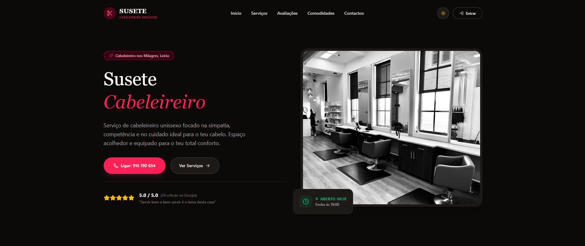
    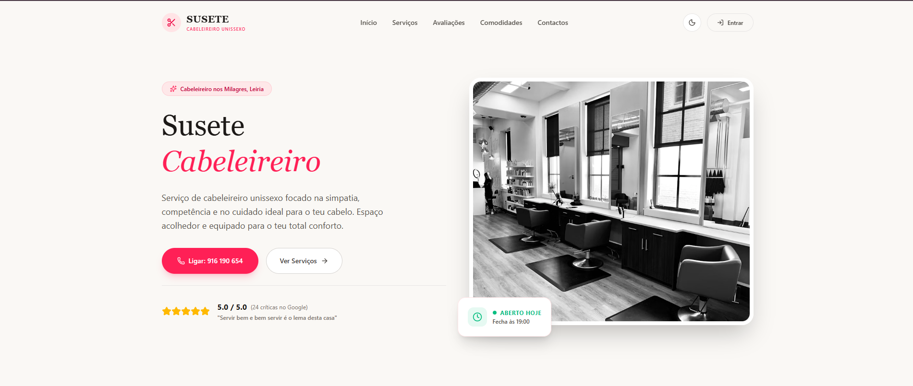
</p>

---

## 💇 Serviços

<p align="center">
    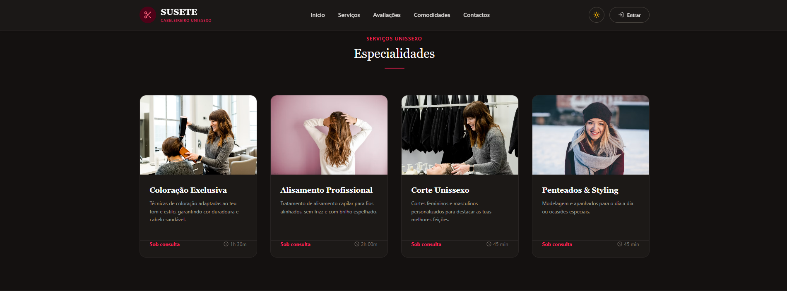
    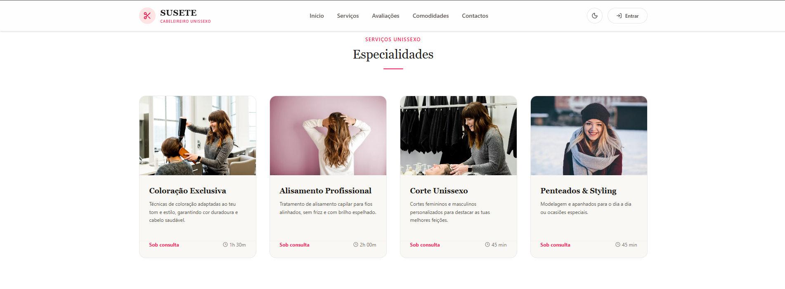
</p>

---

## 📍 Comodidades

<p align="center">
    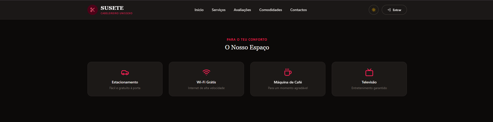
    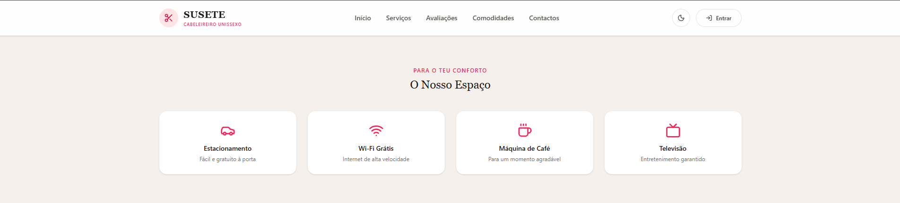
</p>

---

## ⭐ Avaliações

<p align="center">
    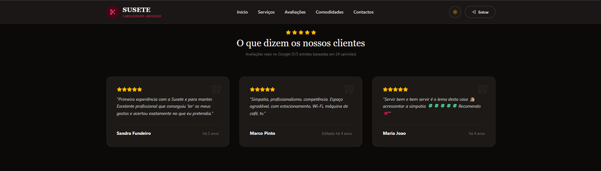
    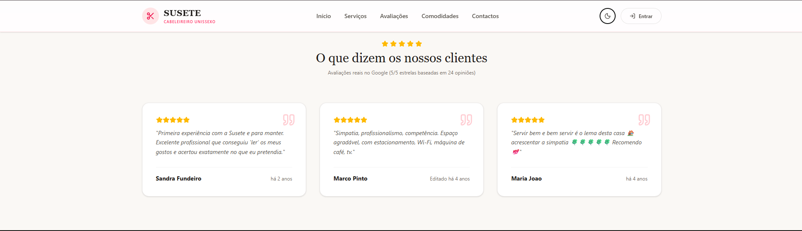
</p>

---

## 🔐 Login & Registo

<p align="center">
    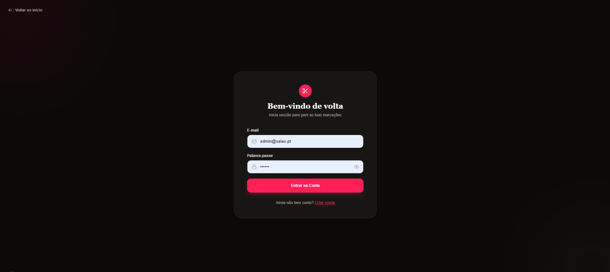
    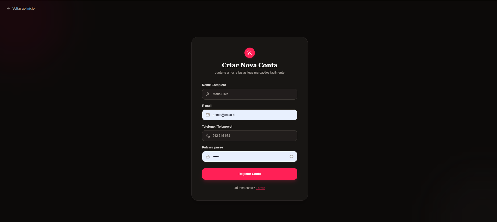
</p>

---

## 📞 Contacto

<p align="center">
    
</p>

---

## 🛠 Painel Administrativo

> O painel administrativo ainda se encontra em desenvolvimento.

<p align="center">
    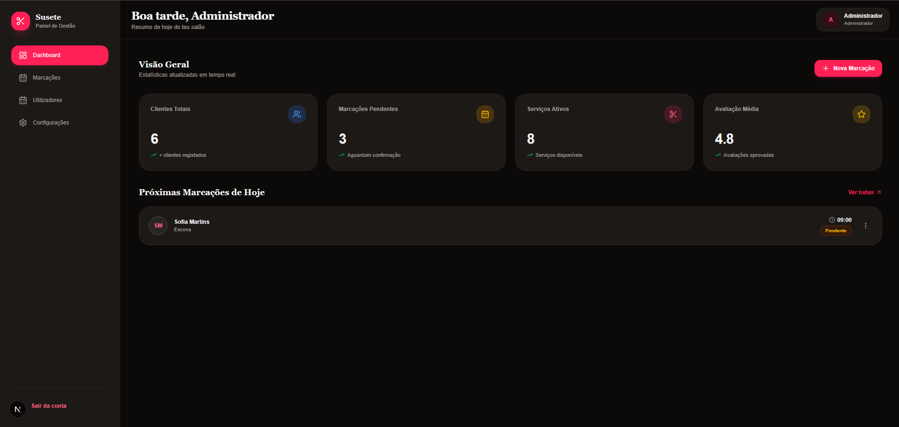
    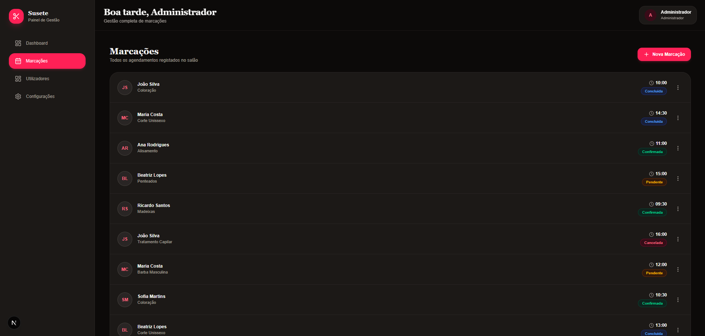
    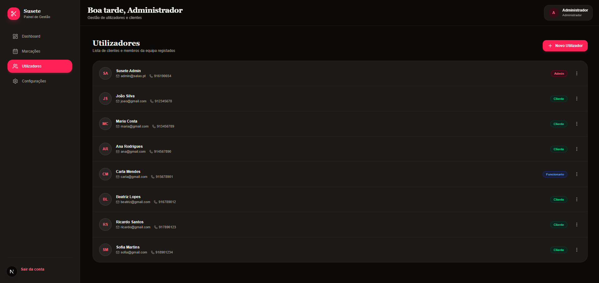
</p>

---

# 📁 Estrutura do Projeto

```text
.
├── app/
├── components/
├── lib/
├── prisma/
├── public/
├── fotos/
│   ├── Admin/
│   ├── avaliacoes/
│   ├── comodidade/
│   ├── contacto/
│   ├── home/
│   ├── login_registo/
│   └── servicos/
├── middleware.ts
├── package.json
└── README.md
```

---

# 📅 Roadmap

- [x] Estrutura inicial
- [x] Página Inicial
- [x] Página de Serviços
- [x] Página de Contacto
- [x] Sistema de Login
- [x] Sistema de Registo
- [ ] Marcações Online
- [ ] Dashboard Administrativo
- [ ] Gestão de Clientes
- [ ] Gestão de Marcações
- [ ] Painel de Estatísticas
- [ ] Notificações
- [ ] Deploy

---

# 🤝 Contribuições

Este projeto encontra-se atualmente em desenvolvimento.

Sugestões e melhorias são sempre bem-vindas através de uma **Issue** ou **Pull Request**.

---

# 📄 Licença

Este projeto é privado.

Todos os direitos reservados © Susete Cabeleireiro.

---

<div align="center">

## 👨‍💻 Desenvolvido por Rafa

**Obrigado por visitar este projeto!**

⭐ Se gostaste do projeto, deixa uma estrela no repositório.

</div>